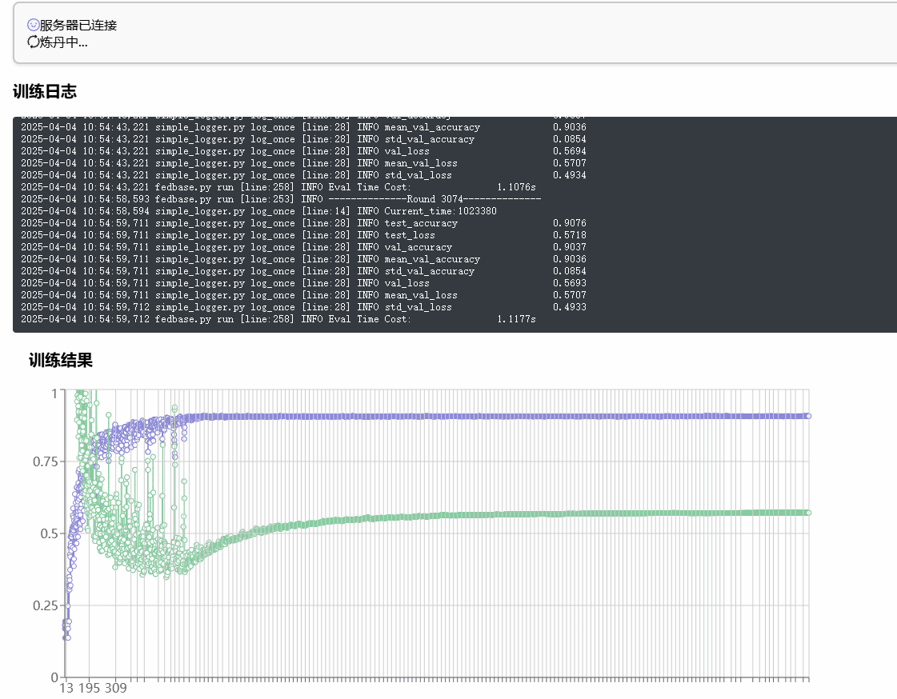
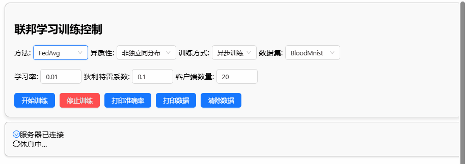
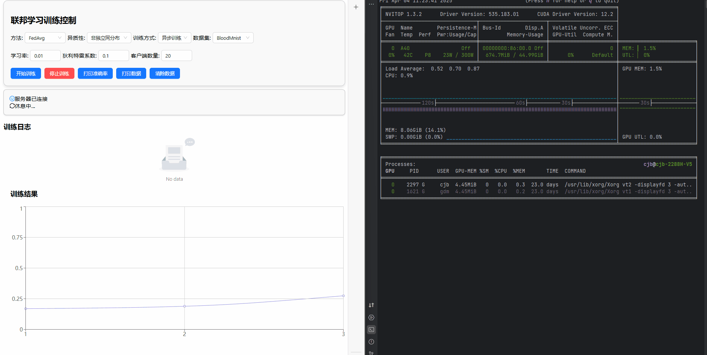
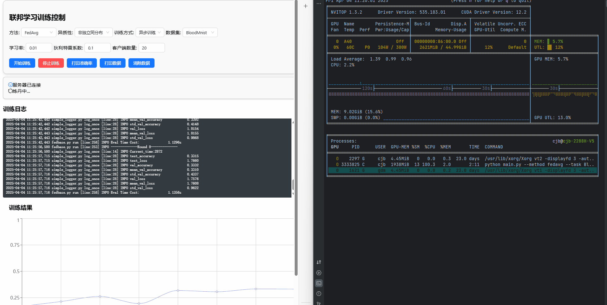
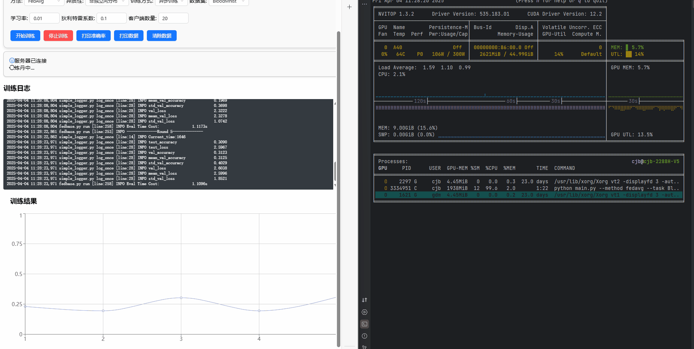
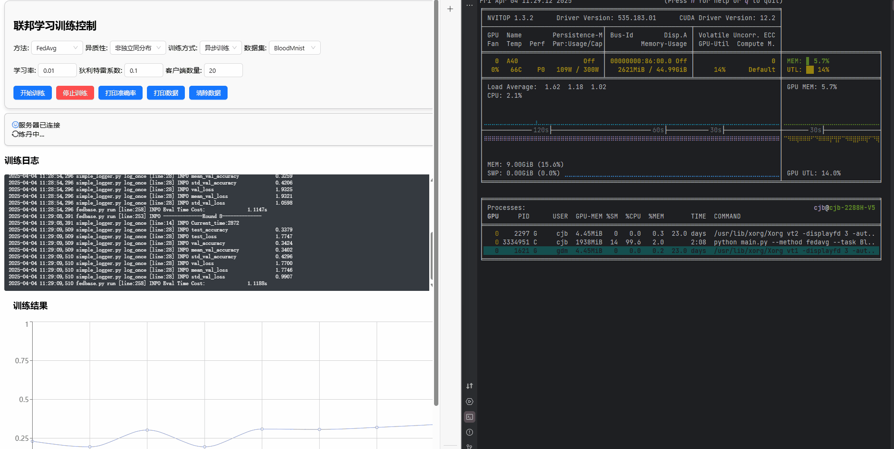
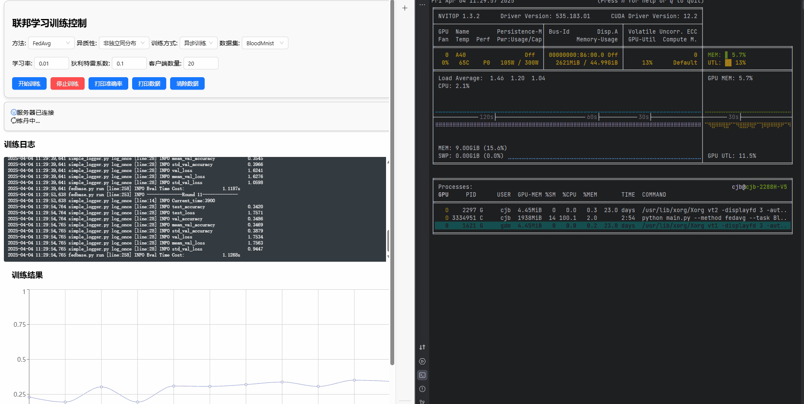

# “炼丹炉”联邦学习web平台 v1

为了⽅便进⾏联邦学习相关的科研实验，我开发了⼀个基于FLGo开源框架（[WwZzz/easyFL: An experimental platform for federated learning.](https://github.com/WwZzz/easyFL)）的web平台，可以进⾏联邦学习训练的控制、实时监测训练过程以及查看实验结果。

***
“炼丹炉”联邦学习web平台 v2 https://github.com/cqupt-lcy/easyfl-v2 
使用NodeJS+Express对后端进行了重写
使用Redux统一管理状态
增加任务导航栏功能，支持新增任务，删除任务，任务重命名
支持多任务同时进行
## TODOS

- [ ] 前端功能受到后端接口限制，学习NodeJS等技术重写后端接口
- [ ] 前端状态管理混乱，学习并使用Redux管理状态
- [ ] 添加多任务功能
- [ ] 添加注册登录功能
- [ ] 优化界面

## 技术栈

前端：React函数式组件+antd

后端：FLGo+FastAPI

网络请求：Axios+WebSocket

数据可视化：ReCharts

数据存储：localStorage

## 论文成果：

《CoGAP: A Personalized Federated Learning Method Using Collaborative Optimization for Medical Image Classification》  ICASSP 2025 已录用  [cqupt-lcy/CoGAP: CoGAP](https://github.com/cqupt-lcy/CoGAP)

TNNLS 在审

## 效果展示：

### Overall

显示训练日志，折线图形式可视化训练结果。

### Setting

包括参数设置，实验开始和停止。

### 实验设置

提供了基本的数据约束

### 开始训练

### 停止训练

### 体验优化

参数设置及结果保存在localStorage中，刷新或关闭页面不会丢失

停止训练时实验结果不会丢失，开启新训练时才清空实验结果

# Getting Started with Create React App

This project was bootstrapped with [Create React App](https://github.com/facebook/create-react-app).

## Available Scripts

In the project directory, you can run:

### `npm start`

Runs the app in the development mode.\
Open [http://localhost:3000](http://localhost:3000) to view it in your browser.

The page will reload when you make changes.\
You may also see any lint errors in the console.

### `npm test`

Launches the test runner in the interactive watch mode.\
See the section about [running tests](https://facebook.github.io/create-react-app/docs/running-tests) for more information.

### `npm run build`

Builds the app for production to the `build` folder.\
It correctly bundles React in production mode and optimizes the build for the best performance.

The build is minified and the filenames include the hashes.\
Your app is ready to be deployed!

See the section about [deployment](https://facebook.github.io/create-react-app/docs/deployment) for more information.

### `npm run eject`

**Note: this is a one-way operation. Once you `eject`, you can't go back!**

If you aren't satisfied with the build tool and configuration choices, you can `eject` at any time. This command will remove the single build dependency from your project.

Instead, it will copy all the configuration files and the transitive dependencies (webpack, Babel, ESLint, etc) right into your project so you have full control over them. All of the commands except `eject` will still work, but they will point to the copied scripts so you can tweak them. At this point you're on your own.

You don't have to ever use `eject`. The curated feature set is suitable for small and middle deployments, and you shouldn't feel obligated to use this feature. However we understand that this tool wouldn't be useful if you couldn't customize it when you are ready for it.

https://facebook.github.io/create-react-app/docs/troubleshooting#npm-run-build-fails-to-minify)
